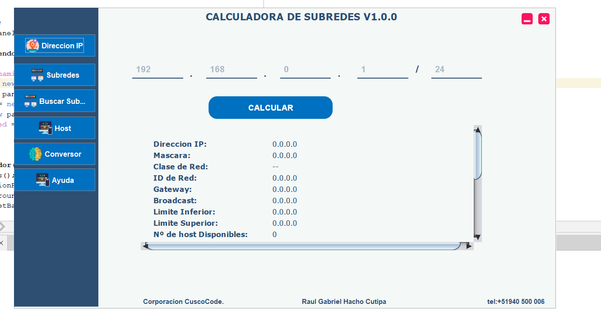
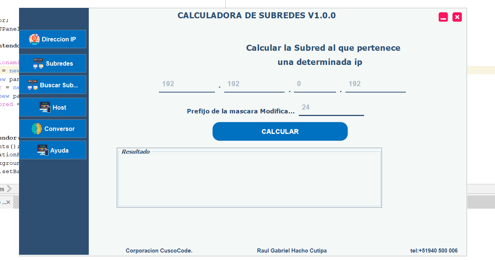
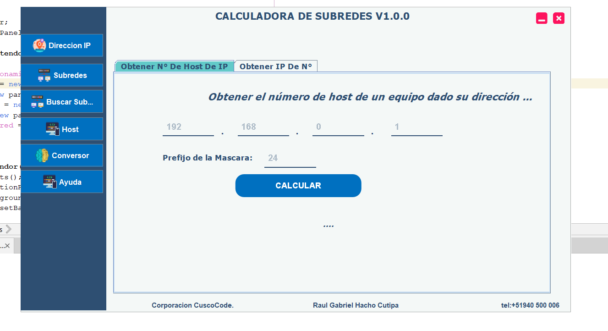
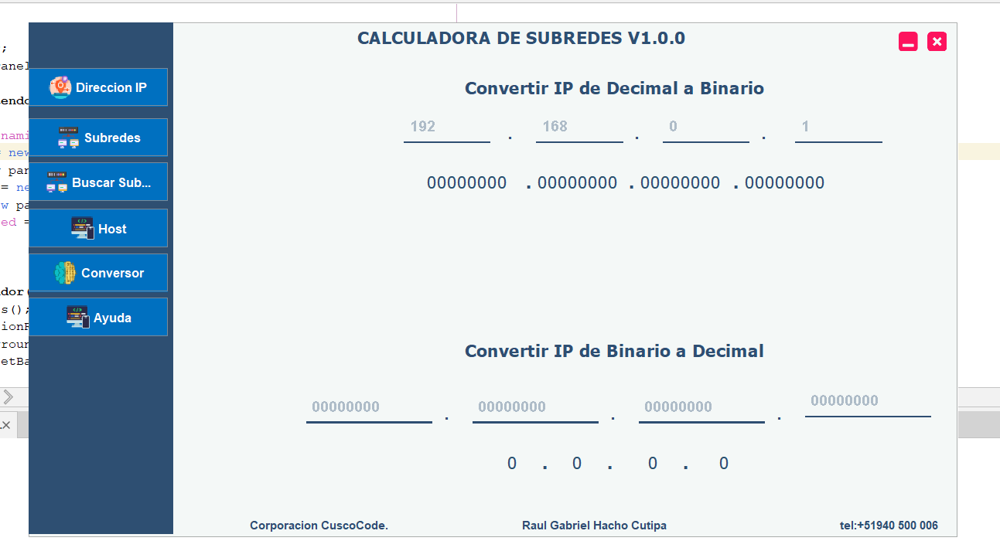
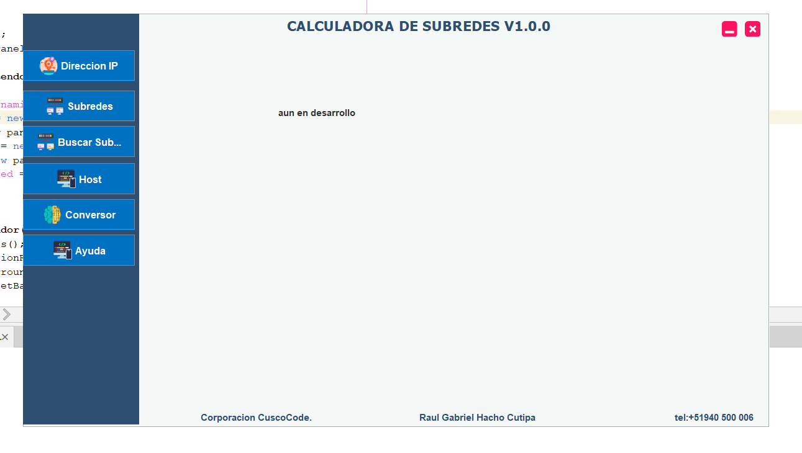

# Calculadora de Subredes (En Desarrollo) 🛠️

Una herramienta de escritorio desarrollada en Java que permite realizar distintos tipos de cálculos relacionados con redes y direcciones IP. Esta aplicación está pensada para estudiantes y profesionales que trabajan con direccionamiento IP, subredes, y operaciones binarias.

## ✨ Características principales

- ✅ Cálculo de subredes IPv4.
- ✅ Conversión de direcciones IP a binario y decimal.
- ✅ Calculadora de bits.
- ✅ Conversión de máscaras y clases.
- ✅ Interfaz amigable, hecha en NetBeans.

> ⚠️ **Proyecto en desarrollo** — Algunas funciones pueden no estar completas o en pruebas.

---

## 🖼️ Capturas de la Interfaz

### 📌 Pantalla principal

### 📌 Ejemplo de cálculo de subred

### 📌 Conversión binaria

### 📌 Máscaras y clases

### 📌 Información adicional

---

## 🔧 Requisitos

- Java JDK 8 o superior
- NetBeans IDE
- Sistema operativo Windows (recomendado para compatibilidad con interfaz)

---
